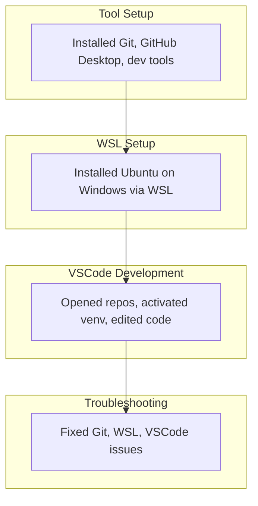

## Visual Journey

Linux is the most compatible OS for Developers.  
  

This flowchart I created helps me think of the Tools and their relationship to my Development Journey in this class so far.

## ⭐ GitHub Pages
After creating my Github Account I made my first repository > I used VSCode.dev a online VSCode editor to make changes to my Github Pages site > This allowed me to update and publish my website through Github Pages.

## ⭐ Operating Systems (OS)
I installed Windows Subsytem for Linux on my Windows Computer > This Let me use Linux tools inside Windows > It allowed me to open my website on "localhost" to instantly look at changes before committing. 

