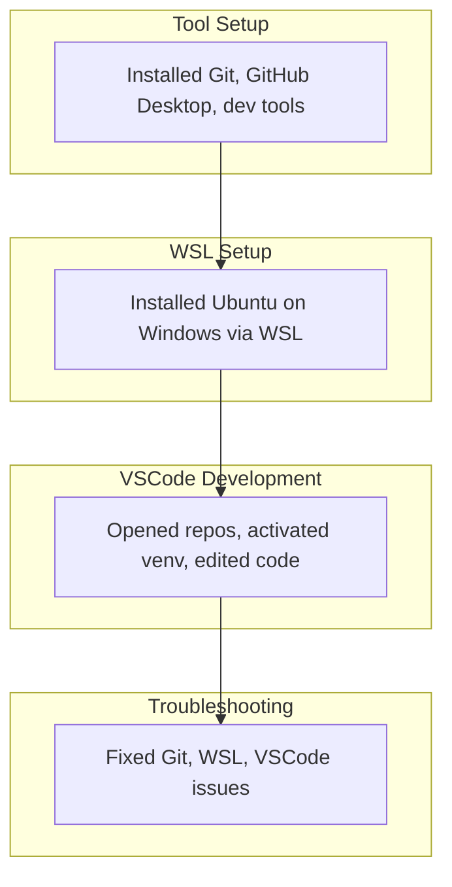

## Visual Journey

Linux is the most compatible OS for Developers.  
  

This visual helps remind me of Tools and their relationship to my Development Journey.

```mermaid
flowchart TD
    %% Tool Setup
    subgraph Tool_Setup[Tool Setup]
        Tool[Installed Git, GitHub Desktop, dev tools]:::local
    end

    %% WSL Setup
    subgraph WSL_Setup[WSL Setup]
        WSL[Installed Ubuntu on Windows via WSL]:::local
    end

    %% VSCode Development
    subgraph VSCode[VSCode Development]
        VS[Opened repos, activated venv, edited code]:::local
    end

    %% Troubleshooting
    subgraph Troubleshoot[Troubleshooting]
        TS[Fixed Git, WSL, VSCode issues]:::local
    end

    %% Arrows connecting
    Tool --> WSL --> VS --> TS

```